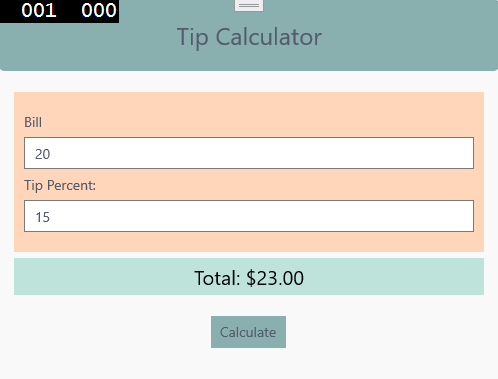
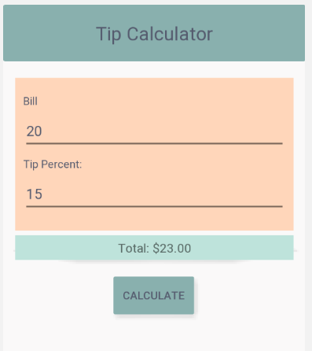

# Assignment 4 - Application Styling

In this assignment, we'll use a couple different ways of styling an application. Your goal will be to recreate an application as shown below. The sample images section shows an example of the application running on both UWP and Android.

You won't be required to make it match pixel by pixel, but your final result should look very similar to what is shown below. This assignment will build upon previous chapters of using layouts and views we've covered so far to create the UI and then apply some of the new styling concepts we've learned this week.

## Sample Images

### UWP Platform Example

### Android Platform Example

## Requirements

You are allowed to use multiple types of styling with this application as long as you have the following:

1. At least one Color defined in a resource dictionary that is referenced for display.
2. At least one usage of implicit styles that applies to multiple views.
3. At least one usage of explicit styels that gets applied to a single view.
4. Make the application function to calculate a tip when the calculate button is pressed.
    - Simple formula: total = bill + (bill * tip / 100)
    - Remember to cast the text values to floating point data types like double or numeric before you do this calculation to avoid integer division
5. Follow the details for elements in the details section below for specific styling details.

### Details

Element | Styling Details
---|---
Page | Background color of #faf9f9
Header | Background color of #89b0ae
Header Text | Text centered and font size of Title
Form Section | Background color of #ffd6ba with Padding and Margin to be similar to examples
Total Section | Background color of #bee3db with Padding and Margin to be similar to examples
Total Section Text | Text centered and font size of Subtitle
Calculate Button | Background color of #89b0ae and centered with the button NOT spanning the whole page
Label, Entry, and Button Views | Text color of #555b6e
    
If you have any questions about the assignment requirements, feel free to reach out.
