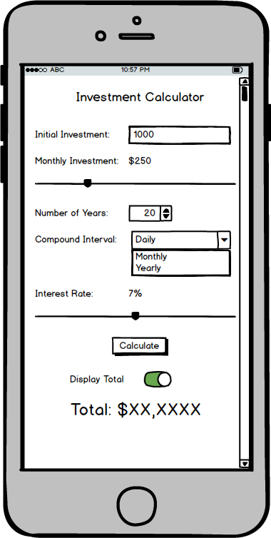

# Assignment 5 - Investment Calculator

For this assignment, you'll create the UI and hook up to business logic that calculates compound interest.  See the UI below for an example of what the final applicatin should look like.  There are multiple ways to get the UI to look similar to below, so there is no single correct solution. Your final output doesn't need to match the layout as long as you use the controls each of the controls listed in the requirements section.

## Completed UI



## Requirements

1. Design the UI to be similar to the completed UI, it doesn't haven't to match exactly and feel free to use different colors if you wish. You will be required to have these following elements
    - The control to use for the number of years is the stepper and does not come with a default label to show the current value.  Create a label that displays the current value and is updated as the value is changed.
    - The interest rate must be a slider. As interest rate is updated, also update a label so the user can see what the select value is.  Note that the monthly investment can be a slider as shown, or you can just use an entry field instead.
    - Depending on your screen size, the layout may or may not need to scroll, so be sure to use the layout that allows scrolling as the main layout for the page.
2. For the compound interval, allow options "Daily", "Monthly", and "Yearly".  Note that when we are calculating the total, we'll use values 365, 12, and 1 (in respect to the order of optiosn above) to represent the selection as we call the CalculateTotal method. The control used for this needs to be the Picker.
3. Use a Switch for "Display Total" to determine if we are going to show the calculated total value or not.  When on, display the total label.  When off, change the label's IsVisible property to be false.
4. When clicking the Calculate button, call the function that has been provided in the calculation logic section below.  Inputs to the function should be pulled from the vaious inputs on the page.  The resulting value should be set to the display of the total value.

## Tips

- Items like the stepper and interest rate you'll want to use the events to change the value of their associated label when the value changes; this will also apply to the monthly investment if you decide to use a slider there instead of an entry
- For other controls, you can give them names and inside the event handler for the button click access the appropriate value from the controls to build the inputs for the CalculateTotal method.  Remember that for some items, you'll have to convert from a Text string property on the control to a double variable to be able to pass into the method
- After calling the method, use the returned double value to set the total display label.  As a friendly reminder, if you use the .ToString("C") as you set the Text property on that label, C# will format the returned double value to currency format for you.

## Calculation Logic

```csharp
        private double CalculateTotal(double initialInvestment,
                                      double monthlyInvestment,
                                      double numberOfYears,
                                      int compoundsPerYear,
                                      double interestRate)
        {
            var periodicInvestment = monthlyInvestment * 12 / compoundsPerYear;
            interestRate /= 100;

            var innerCalculation = Math.Pow(1 + interestRate / compoundsPerYear, compoundsPerYear * numberOfYears);
            var compoundInterestForPrinciple = initialInvestment * innerCalculation;
            var futureValueOfSeries = periodicInvestment * (innerCalculation - 1) * (compoundsPerYear / interestRate);
            return compoundInterestForPrinciple + futureValueOfSeries;
        }
```

## Sample Outputs

Initial Investment | Monthly Contribution | Years | Compounding | Interest | Total
:---:|:---:|:---:|---|:---:|:---:
1000|250|20|Monthly|7|$134.270.40
1000|250|40|Monthly|7|$672,514.76
0|300|30|Monthly|7|$365,991.30
5000|400|40|Monthly|7|$1,131,482.42

Side note - start investing early!