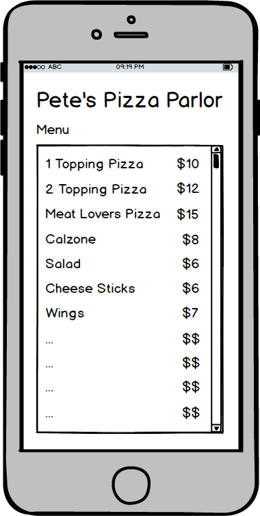

# Assignment 6 - Menu List

For this assignment, you'll create a simple application that displays a list of items that can be found at a store.  The list item will show a description for the product along with the price.

## Sample UI



## Requirements

1. Have a header for the name of the fictional store / business
2. Have a list of products / services listed
3. Each list item must show:
    * Product name
    * Price
4. Use a ListView control

Format of the items in the listbox isn't strict for layout.  You may choose to display the items in a different format, add extra display properties, add an image, or etc.  As long as a list is displayed with at least a product name and price, no points will be deducted.

## Sample Data Model Class

The following may be used as a reference for a simple data model class to use for building the list.  Feel free to add new properties, rename properties, or however you choose to implement your data class:

```csharp
    public class Item
    {
        public string Name { get; set; }
        public int Price { get; set; }
    }
```